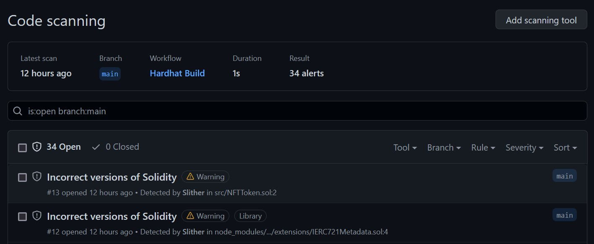

# Soulbound NFT

This repo is about a Soulbound NFT, an NFT that can be only minted and not traded or transferred, it is bounded to the first owner. The project environment is foundry with hardhat integrated. The GH workflow tests **(foundry solidity and hardhat typescript)** the contracts and [uses Slither to statically analyze the code](https://github.com/crytic/slither), trying to find the most common vulnerabilities. When found they are notified in the GH security code scanning area, as you can see in this screenshot:


## Develop

### Unit Tests

To run the unit tests suite (in Typescript), you'll need to run:

```bash
yarn install
```

then run the following:

```bash
npx hardhat test
```

### System Tests

End-to-end tests have been written in Solidity, using Foundry.

To get set up:

1. Install [Foundry](https://github.com/gakonst/foundry).

```bash
curl -L https://foundry.paradigm.xyz | sh
```

2. Install external lib(s)

```bash
forge install
```

3. Run tests:

```bash
forge test
```

4. Update Foundry periodically:

```bash
foundryup
```

Resources:

- [The Forge-Book](https://onbjerg.github.io/foundry-book/forge)

## Contributors ✨

Thanks goes to these wonderful people:

<!-- ALL-CONTRIBUTORS-LIST:START - Do not remove or modify this section -->
<!-- prettier-ignore-start -->
<!-- markdownlint-disable -->
<table>
  <tr>
    <td align="center"><a href="https://it.linkedin.com/in/lorenzo-zaccagnini"><br /><sub><b>Lorenzo Zaccagnini</b></sub></a><br /><a href="https://it.linkedin.com/in/lorenzo-zaccagnini" title="LinkedIn">💬</a> <a href="https://github.com/LorenzoZaccagnini" title="GitHub">📖</a></td>
   </tr>
</table>
<!-- markdownlint-enable -->
<!-- prettier-ignore-end -->
<!-- ALL-CONTRIBUTORS-LIST:END -->

This project follows the [all-contributors](https://allcontributors.org) specification.
Contributions of any kind are welcome!

## LICENSE

[Mozilla Public License Version 2.0](LICENSE)
